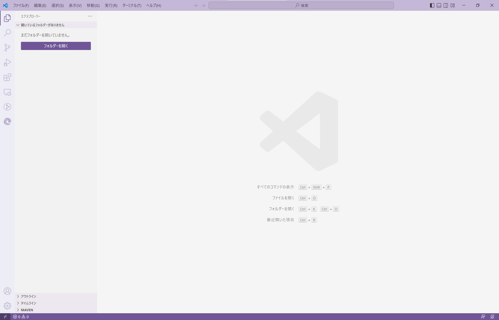

# Python 的基础

## 基础环境的安装

Python (你即将学习的编程语言): 请在[官网](https://www.python.org/downloads/)下载。如需选择目录安装，或有其它需求，请按照安装器的提供的选项操作。准确来说，我们学习的是Python 3，它和Python 2有较大的区别。

IDE (能帮你更好地写代码的东西): 推荐使用[VSCode](https://code.visualstudio.com/Download)。 (这里是我使用的[代码配色方案](https://github.com/OzelotVanilla/vscode_colourscheme)，它可以给你的代码提供颜色、粗细等效果；相同类型的颜色，代表了相同或相似的“某个东西”)。

上面两个软件都安装完毕后，在VSCode下载关于Python的插件。

## 打开IDLE

当Python安装器完成了它的工作后，在你的应用程序面板搜索一个名字叫做**IDLE**的应用程序。大概图标会长成这样:


打开它，你将会发现一个类似于这样的画面:


这个是Python的**交互型解释器**。**交互**代表它可以通过你提供Python语句后，按下回车，来返回执行结果。而这一执行过程，便是**解释**你输入的文本，并返回处理后的结果。别被专业术语吓倒! 如果你觉得这些不好理解，没关系，你可以先把它当成一个你忠实的管家——你告诉它它该做什么，它就照你所说的执行。但是，如果你说的话有问题，管家理解不了的话，想必是他也很难给出你一个正确的结果，或者是要求再重说一遍吧。有点死板，但不坏。


> #### IDLE为什么叫这个名字呢
>
> 它的全称是**Integrated Development and Learning Environment**，一个**集成的开发及学习环境**。当然，这个只是一个名称而已，不需要你一定记下来。

## 做一些基础的数学吧!

在我们学习复杂的东西之前，让我们先导入一些简单的东西吧。编程其实真的不应该弄得那么难对吧(大概)。

相信大家的基础数学知识一定很好，让我们来测试一下这位管家能不能胜任这个职位呢?

我们先从一些简单的符号入手:

**四则运算的运算符**是我们在小学及之后的数学课本上，常常能看到的符号。加、减、乘、除，四种基本的运算构建出一个又一个庞大的理论世界。尽管随着数学的发展，四则运算符可能被*借用*，多出了很多不同于小学课本上的用法，但绝大多数编程语言中，`+`、`-`、`*` (代表**乘号**，是个**星号**，`Shift + 8`在大部分键盘上)、`/` (代表**除号**，是个**斜杠**，在右`Shift`左边的那个键，上面应该有个问号`?`)，这四个符号保留了最基础的那个含义。

数字，当然也和数学*一样*(其实是*差不多*)，整数小数，一应俱全的。

先考考你的管家他的加法好不好 (这个空格不是必须的，但为了美观，加上也不坏)，在三个`>`的后面，输入这个试试看:

```
>>> 1 + 1
```

他的回答是`2`，很好，让我们稍微提升一下难度:

```
>>> (-3398274302399266087) + (-1263457668965642370)
```

…他当然也算得出就是了。

那么这里大家不妨用一下`*`或者`/`来考考他会不会乘除法，或者试试看小数。如果既有加减又有乘除法，他会弄得明白<u>计算的先后顺序</u>——**运算优先级么**?

> 如果发现什么反直觉的地方要积极提问的呀，基础的理解，错了会很麻烦(<u>真的</u>)

## 试试看你的IDE?

> 如果你下载了VSCode作为你的IDE，那么恭喜你，因为作者很懒，她只写了VSCode有关的部分
>
> (但如果你都已经会用别的IDE了，我相信这些基础的操作知识你一定会吧，会的吧)
>
> (当然也许你早就发现了作者只用，也只会用VSCode)(てへっ😜)

首先，如果你不认识**IDE** (Integrated Development Environment，集成的开发环境，注意不是刚刚管家会出现的程序**ID==L==E**)这个词的话，其实问题不大。你可以把它们当成是一个超级强大的文本编辑器。它们能帮你写代码更轻松(自动补全)，会主动标出你的(编程的语法)错误，可以方便你快速地执行代码啥的，是不是很好用。你能想象如果用记事本软件写代码，没有这些功能，那是多么，多么的痛苦(但确实有人这样写代码，我们也要尊重他们的习惯)。

就像刚刚你找到那个叫**IDLE**的管家一样，这次请你找到**VSCode**。

打开，你将会获得类似这样的一个界面 (VSCode启动时是英语，但是你可以加载扩展包来使用任何语言! 点击左侧栏的“三个方块和一个方块”的**扩展安装及管理**图标，搜索你想要的语言(用英语写，比如**Chinese**)，点击安装就好):



然后安装一个Python的扩展吧，这个扩展可以帮助你更好地写Python代码，比如给你很智能很厉害的补全啥的，你只需要打出一两个字，就可以补全一长串，是不是很不错? 那么，如果你刚刚安装完了语言扩展包，就再搜索`Python`来安装它吧，安装完了大概会长这样(请无视语言设定):


接下来，为你的Python代码文件创建一个文件夹吧。请记住文件夹的位置，然后按下`Ctrl + K` `Ctrl + O`两个组合键，来**打开一个文件夹** (或者在最上面的*菜单栏*，通过*文件-打开文件夹*来打开)。打开以后大概是这样的界面 (<del>左边的区域看起来有很多文件，但如果你打开一个空文件夹/新建一个文件夹，你当然看不到有文件，以及这句话是不是有点多余?</del>):


点击来创建一个新文件，点击来创建一个文件夹。那我们先来创建一个叫`pytest.py`(`py`文件后缀代表了这是一个Python代码文件)的文件如何，这个文件的意图是“作为测试文件使用”。

这时候，我们会发现，刚打开的文件和刚刚看到的**IDLE**的界面不太一样。这里没有`>>>`的输入提示，按下回车也不会有任何东西显示给你看……那是因为这个只是一个(比较强大一些的)<u>文本编辑器</u>啦。那么如何叫出我们的管家来呢，先别急，先聊一下一个叫**函数**的东西。

回想一下学的数学知识，说到函数，你大概会想到像$f(1)$这样的东西。编程语言里的函数，和之前大家在高中学到的有那么一点点不一样，具体细节我们留待日后再细说。先教给大家一个函数叫`print`。在函数的名字后面加上一对小括号，就可以让这个函数“工作” (在编程里我们叫它**调用**)；在这个括号里面的内容，就是函数的**参数** (和数学概念的“参数”也很像)。

在小括号里放上一些内容吧，先从刚刚大家熟悉的代码开始。试试看这个，观察一下结果，猜一下这个函数是做什么的 (注意请把你的键盘切换到英文输入。以后我们说的所有的符号，都是英文输入模式下的符号，不要写成中文的符号哦x)。

```python
print(1 + 1)
```

当你把想要运行的内容写在这里之后，点击右上角的这个播放图标，来执行代码:


这时候你会发现下面有一个**控制台**(白色的框框)，“波拥~”地一下弹出来，然后“卡塔卡塔”地出来好多的字，然后在这里停了下来 (前面显示的`PS D:\Code\Code test\Python`和`E:/Software/Python/python.exe`会因为操作系统、安装目录和选择的文件夹不一样，和这个截图上有一些出入。但在这个千变万化的复杂世界中，不变的部分是中间出现的这个"2"，还是值得庆幸的):


我们的管家在这里又出现了，并且也顺利地完成任务，输出了一个`2`。

这时候我们试试看把`print`和两边的括号去掉，只在这一行留下一个`1 + 1`。试试看这次运行会有怎样的结果 (为了减少不必要的图片加载，以后运行结果除非有特殊效果，剩下来的都直接以纯粹的文本来表示w <del>真不是我在偷懒</del> 如果你发现下面的框框前面有个"1"，那个不是显示结果，是**行号**，标记现在是第几行用的):

```
```

(运行完了，但这不是什么都没有显示出来么!)

是的，如你所见，就是什么都没有，因为这就是`print`函数的作用! 这下大家知道`print`是做什么的了吧? 它负责把括号内的内容，输出到屏幕上去。但这个时候是不是又会好奇一个问题: 我输入的是`print(1 + 1)`，那么为什么不是输出`1 + 1`，而是输出了运算结果呢? 那就进入下一个部分吧。


> #### 何时使用VSCode等IDE，又该何时使用Python的IDLE呢?
>
> 就我个人的使用习惯而言，如果是想测试某个Python的语法或者是功能等，不需要为此而创建多个文件或者保存文件的话，我使用**IDLE**。
>
> 但如果需要创建多个文件(比如做一个小项目)，需要留存记录，需要语法提示等等拥有较为复杂的需求的情况下，推荐使用**VSCode等IDE**。
>
> IDLE可以很方便地打开并进行交互，但是，IDLE没有更加智能的补全，书写手感也不算太好。这些说到底也只是一些个人感受，之后大家用着用着，就会有自己的看法，也能在合适的情况下挑选更加趁手的工具啦😊。

> #### 让IDE提升你的书写效率
>
> 除了补全和语法检查这些贴心的功能外，像是VSCode等IDE还具有很多方便的功能。这就需要大家在网上搜索，并适当记住一些自己常用的使用技巧。我给大家推荐一个技巧，如果你想要用括号(圆括号`()`，方括号`[]`，波括号`{}`)来包住某一个部分，让这个括号刚好出现在两端的话，只需要选中这个区域，按下这些括号的左侧部分(比如先选中，再按下`(`键)，就可以用括号包裹住这些内容啦。
>
> 除此之外，某些插件也可以提高效率。VSCode有一个叫做`TabOut`的插件。这个插件可以用`Tab`键，跳出成对符号的右侧部分。比如当你输入`print(a)`时，光标停在了`a`和`)`的中间，这时按下`Tab`就可以让光标右移到`)`的后面，不需要按方向键，是不是很方便x

## **表达式**和**评价**

刚刚我们在**IDLE**中，充分地体验了一下数学运算的快乐。那么，现在引入一个概念——“表达式”。就像你刚刚写的那些式子，以及未来会学习的**能运算出各种结果**的式子，它们都是**表达式**。给表达式**求值**求出一个最终结果，这个过程就是**评价**。如果你在某处书写了一个表达式，那么在执行时，它一定会被评价出一个值，而不是“我自岿然不动”。所以说，对于刚刚的`print`为何不输出`1 + 1`的那个疑问，解答就是: `print(1 + 1)`在执行时，它首先需要求出`1 + 1`到底是个啥，然后再交给`print`函数，让它完成它的工作，就像一道流水线。

> 这里你可能会觉得**表达式**这个概念定义地很含糊，但其实要是引入了专业的概念的话，会把大家绕晕的。有兴趣的同学请在这里自行上网查询w

表达式要想求值，肯定要先弄清楚一个顺序。刚刚的算数环节，大家可能*并没有*发现一些奇怪的因为顺序而运算错误的结果——比如`1 + 2 * 3`，Python管家可以很正确地算出了结果`7`，而不是先计算`1 + 2`。这里就涉及到了谁先谁后——**运算优先级**的问题。一次性说出来可能会难以记住，但好在多数编程语言都是按照基础数学的方式，规定运算顺序，所以目前不用担心，按照数学上的优先级来理解就好。如果对优先顺序不确定，可以在两边加上小括号，来把该部分设为优先计算(和数学上一样)。比如，在Python中，`**`代表**乘方**运算。如果你不确定它的优先级，可以这样`1 + (2 ** 3) + 4`，最终输出结果`13`。


> #### 一样的，和不一样的 (写给学过了别的编程语言，或者是对编程有了解的人)
>
> 编程语言之间，当然有相似之处，但是有些基本概念上的差异，却会在很大程度上影响代码的执行结果。
>
> 在学习完一门编程语言之后，如果打算开始学习新的语言，一定记得不要跳过基础部分。你可以选择快速地阅读它们，跳过一些基本不会有太大差异的部分(比如`+`的定义，在数字上的那种)，但请看清楚每一句话，不要带有很多“预设”来解读它们。
>
> 比如，刚刚使用过的整数。如果你学了其它编程语言，会不会想：“得小心`int`溢出，那有没有不会溢出的无限制的整数呢?”
>
> 再比如，如同`1.5`这样的小数。如果你恰好知道`type`函数可以查看实际类型，于是你输入`type(1.5)`，得到了`<class 'float'>`，你也许就想：“原来整数是`float`型啊，那一定是32位的吧。”
>
> 但实际上，Python的整数不限制长度，而且Python的float类型精度一般实现为64位 (可以查看[官方文档](https://docs.python.org/3/library/stdtypes.html?#numeric-types-int-float-complex)的说明)。这样的预设极有可能会给你之后编程带来很多麻烦，比如你尝试寻找有关`bigint`的语法提示，却发现根本没有；如果你尝试搜索，可能会发现，Python 2还有`int`和`long`之分，但是在Python 3里早已废除，`int`已经没有长度限制了……
>
> 总结一下子，就是：如果你已经学过一些别的编程语言，请在看这个教程时，不要因为某些概念的出入而感到惊讶，而是最好能记下它们的区别，别绕晕自己。
>
> 当本教程出现一些，在基础上和别的语言设定出入较大的地方时，会尽量在醒目处表明，以防大家略过去了。
>
> (<del>别问我为什么这么说x</del>作为学完Java自己摸索C++的人来说，我不希望你们再被各种坑了。以及，正式学习使用C++前，我也不是完全对其零基础，但这仍然没有让我做到不受到Java预设的影响)

## Python里的基础的类型

在Python里，有一些东西无需你自己定义，就可以“开箱即用”，这些东西就是Python中的`builtin`，内置模块啦。比如你刚刚使用了诸如`1`、`64`、`-3398274`这样的**整数**，或者是`0.3333`、`1.5`、`4.000001`这样的**小数**，他们在Python中早就定义好，直接可以给你用，是不是很方便。**整数**在Python中叫做`int`，小数叫做`float`。但要注意，小数会有一个精度上限。比如$1.2345678923456789$、$\dfrac{1}{3}$这样的有理数，或者像$\pi$这样的无理数，我们**没法用有限的空间去完全表示**它们；如果使用小数`float`来表示，它们就会被**近似**成一个值。但请放心，尽管说是近似，但大部分情况已经足够使用，没有问题!

### 存放文字的容器——字符串

这里再介绍一个新的东西“字符串”，它保存的内容就是**内部的文字**，用`print`输出的话，就会把这些文字给打印出来。对于刚刚的那个`print(1 + 1)`的疑问来说，如果你把`1 + 1`放在一个**字符串**内，它就当然不会被计算，因为字符串保存的值就是**其中的文字**，它已经是一个合格的、最终算好的**值**啦，当然不会再被计算w

> #### 有趣的`eval`函数
>
> `eval`会把字符串中的内容当作表达式来理解。如果你执行`print(eval("1 + 1"))`的话，会得到一个`2`。

字符串的表示方法是，用单引号`'`或者双引号`"`，包住想要作为内容的部分。举个例子，假如你想要用字符串记录"abc"这三个字母，只需要写`"abc"`就好。但是像**换行符**这样的文字，不方便直接书写在字符串里，我们就用一种叫做**转义字符**的东西替代，用更简单的方式表述它们。最常用的换行符，我们用`\n`来代表它。如果下次需要保存的内容不止一行，我们就直接用`\n`，告诉我们的Python管家，我们需要在这里换行。

> 转义字符也有很多哦~ 自己去网上查一查看一看怎样? 

用`print`函数，在IDLE里试试看显示输出一些带换行的句子?

```
>>> print("Lorem Ipsum\nText starts here,\nends here.")
Lorem Ipsum
Text starts here,
ends here.
```

如上面的例子一样，即使我们在字符串中书写了`\n`，也不会显示出一个`\n`在输出结果里。这时候大家可能要问了，那我真的想输出一个"\n"，一个**反斜杠**和一个"n"，应该怎么办呀……这里给大家猜一下应该怎样做；提示一下，转义字符都是一个反斜杠后面，跟上某些内容来构成，但一般都是跟上一个文字。假如你是最早的语言设计者，你先想到了`\n`，这时你会怎么表现一个**单纯的反斜杠**呢?

> #### 写在答案之前：像一个设计者一样思考
>
> 大家有没有尝试在学习一种东西时，假设自己是一个设计者? 
>
> * 不是死记硬背，而是思考“为什么要这样设计”。
> * 当发现一个不符合直觉，或是不符合你的喜好的某个设计时，能尝试说服自己为何会有这样的设计。
> * 如果一个地方有些怪怪的，尝试自己提出一个新的设计，并试图证明它的合理性。
> * 怎样设计，才能让使用者更加轻松愉快?
> * ……
>
> 也许下次用这样的方式，学习某些东西时，会更加轻松一些? 甚至学着学着，就构建出了一个新的方案也说不定! 不要小看自己的力量呀ww
>
> (这样的学习方法，可能会适用于那些由人类构建出来的，而不是解释客观世界的学科。比如计算机，或者线形代数?)
>
> (而像(人类交流使用的)**语言**这样的学科，也许更加适合像一个语言学家一样，从中寻找某个规律出来?)

揭晓答案: 比我们早些年的设计家，采用了`\\`来表现一个反斜杠。你没看错x 它就是**两个反斜杠**而已。但仔细想想，是不是很合理。想要输出"\n"，那么就在字符串里写`\\n`，让第一个反斜杠和第二个反斜杠为一个整体，第三个"n"就不会受到影响，可以输出它本身啦🎉

> 既然反斜杠要作为转义字符的一部分了，没法单独使用了，那与其弄一个类似于`\s`一样的东西代表反斜杠，不如用两个反斜杠来得直观一些。
>
> 但假如我一个字符串不需要转义字符，却有一堆的反斜杠，怎样让我写起来更轻松? 这个问题我们之后再回答，先吊一下你的胃口ww (<del>作者是腹黑，绝对是腹黑</del>)

字符串先介绍到这里。但之后还有对它的更多用法的教程，谁叫它这么重要呢w

### 告诉我真与假——逻辑值

回想一下我们的小学数学，老师让我们往框框里填上大于号或者小于号。如果是3和5，我们就往中间填上小于号；如果你填上大于号，那就会得到一个0分 (毫无悬念地)。

这里就延伸出了我们的`True`和`False`。当你写出类似`2 < 3`这样正确的式子的时候，那你做对了，因为2**真的**比3要小；那如果你写出了`2 > 3`这样的式子，因为2怎么会大于3嘛，**假的假的**。但这里和数学可能不太一样，出现`False`不一定代表是不好的，甚至是错误的。比如假如有一个函数判断今天是否下雨，如果不下，它就给出`False`，这完全是一个正常且符合预期的结果。

像`2 < 3`这样的可以判断出真假的式子，最后会被评价成到底是真是假，是`True`还是`False`。这就是逻辑值，在Python中叫做`bool`类型。之后大家就会发现它的更多用途，别忘了我们有一个强大的东西叫**评价**。

## 开启Python的大门

这些东西看下来，感觉如何?

别着急，我们才刚刚推开Python的大门呢! 前方依旧是一片迷雾，树后面好像还随时会跳出来几个危险生物。别担心，跟着教程走，这篇教程会教会你在这片丛林中的生存技巧，再让你去自由探索更多。
